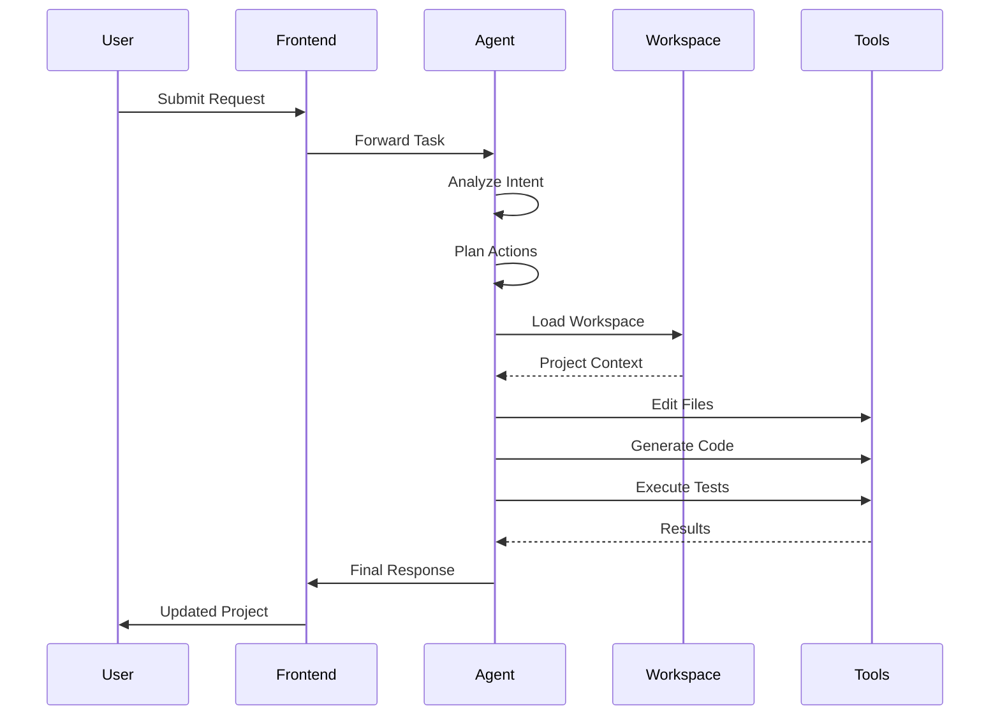

# Anna SDK


<h3 align="center">
# Anna SDK

An experimental demo that pairs a modern React frontend with a small autonomous-agent prototype for generating and manipulating demo workspaces. This repository is intended as a hackathon-style playground for exploring AI-assisted development workflows.

## Contents

- Overview
- Quick start
- Architecture & important files
- Development notes (frontend + Agent)
- Contributing
- License

## Overview

Anna SDK is a lightweight demo that illustrates how a frontend UI and an autonomous Node.js agent can work together to generate, edit, and run small project workspaces. The project includes:

- A React + TypeScript frontend (routes, components, and a mocked login flow).
- An Agent/ microproject with skills, workspace templates, and runtime code used to generate and modify projects.
- Example/demo workspaces under `Agent/workspaces/` used by the agent and for local previews.

### Why this repository

This codebase is useful when you want a minimal, opinionated setup to experiment with:

- agent-driven code generation and workspace manipulation
- integrating AI-assisted flows into a familiar React app
- building UI components and small SPA layouts that the agent can operate on

## Quick start

Install dependencies (root):

```bash
npm install
```

Run the frontend dev server (Vite):

```bash
npm run dev
```

Run the Agent in development mode (from root):

```bash
npm run dev:agent
```

Start both together (dev helper):

```bash
npm run dev:all
```

Build for production:

```bash
npm run build
```

Preview a production build:

```bash
npm run preview
```

See also: `npm run lint` and `npm run format`.

## Architecture & important files

- `src/` — frontend source. Key route: `src/routes/login.tsx` (mocked sign-in flows and the Google button).
- `src/components/ui/` — local design-system primitives used throughout the app.
- `Agent/` — independent microproject implementing the agent runtime:
    - `Agent/src/` — generator, workspace, RPC and model utilities.
    - `Agent/skills/` — markdown-based skill definitions that describe agent capabilities.
    - `Agent/workspaces/` — small example projects the agent can operate on.
- `bundle/` — built/demo artifacts.
- `scripts/dev-all.js` — helper that can start frontend + agent together (used by `npm run dev:all`).

The login route (`src/routes/login.tsx`) intentionally contains commented sections: an API-key input panel and a divider are present but disabled in the demo. The Google sign-in flow is mocked with simple timers that simulate auth and redirect to `/app`.

## Development notes

### Frontend

- This is a Vite + React + TypeScript app. Styles use utility classes compatible with Tailwind conventions.
- Common commands:

    - `npm run dev` — start Vite dev server
    - `npm run build` — build production bundle
    - `npm run preview` — preview build

### Agent

- The `Agent/` folder contains a small Node.js runtime. The root `package.json` exposes `dev:agent` which runs the Agent's dev script via `npm --prefix Agent run dev`.
- To run the Agent directly:

```bash
cd Agent
npm install
npm run dev
```

### Notes on the demo behavior

- The login flow and API-key handling are intentionally mocked for the demo. Re-enable the commented API-key UI in `src/routes/login.tsx` if you want to accept keys locally.
- The Agent uses markdown skill files (in `Agent/skills/`) to define its behaviors. The workspace templates in `Agent/workspaces/` are intentionally small static projects useful for testing generation and edits.

## Contributing

- If you want to extend this demo:
    - Add new skill files in `Agent/skills/` to encode behaviors you want the Agent to perform.
    - Add or modify workspace templates in `Agent/workspaces/` for richer test projects.
    - Reuse components in `src/components/ui/` when adding pages.
- Please run `npm run lint` and `npm run format` before opening a PR.

## License

MIT

## Acknowledgements & next steps

- This repository is set up as a prototype/demo. If you'd like, I can:
    - Re-enable and wire the API-key input flow in `src/routes/login.tsx` with a mock validator.
    - Add a short CONTRIBUTING.md with development guidelines.
    - Generate a minimal example showing the Agent editing a file in one of the workspaces.

Enjoy exploring the project!



---

# Repository Structure

```text
Anna-SDK/
│
├── src/
│   ├── routes/
│   ├── components/
│   ├── hooks/
│   └── services/
│
├── Agent/
│   ├── src/
│   │   ├── generator.js
│   │   ├── workspace.js
│   │   ├── rpc.js
│   │   └── model.js
│   │
│   ├── skills/
│   ├── tools/
│   ├── tests/
│   └── workspaces/
│
├── bundle/
│
├── package.json
├── vite.config.ts
├── start-anna.sh
└── README.md
```

---

# Technology Stack

| Layer                   | Technologies        |
| ----------------------- | ------------------- |
| Frontend                | React, TypeScript   |
| Routing                 | TanStack Router     |
| Styling                 | TailwindCSS         |
| Icons                   | Lucide React        |
| Agent Runtime           | Node.js             |
| Build Tool              | Vite                |
| Testing                 | Node Test Utilities |
| Workspace System        | Custom Runtime      |
| Development Environment | Bun / npm           |

---

# Agent Architecture

The Anna Agent follows a modular architecture:

### Skill Engine

Defines capabilities and behaviors using markdown-based skill definitions.

### Planner

Breaks user requests into executable tasks.

### Generator

Produces source code, configuration files, and project structures.

### Workspace Engine

Manages project environments and maintains execution context.

### RPC Layer

Handles communication between the frontend and the agent runtime.

---

# Development Setup

### Clone Repository

```bash
git clone https://github.com/your-org/anna-sdk.git

cd anna-sdk
```

### Install Dependencies

```bash
npm install
```

### Start Frontend

```bash
npm run dev
```

### Start Agent Runtime

```bash
cd Agent

npm install

node server.js
```

---

# Future Roadmap

* Multi-agent collaboration
* Autonomous debugging
* Cloud workspace execution
* Plugin marketplace
* Agent memory system
* CI/CD integration
* Real-time code streaming
* LLM provider abstraction

---

# Vision

Anna SDK aims to become a next-generation autonomous development platform where AI agents can understand, plan, generate, test, and deploy software with minimal human intervention while keeping developers fully in control of the workflow.

---

## License

MIT License

Copyright © 2026 Anna SDK
